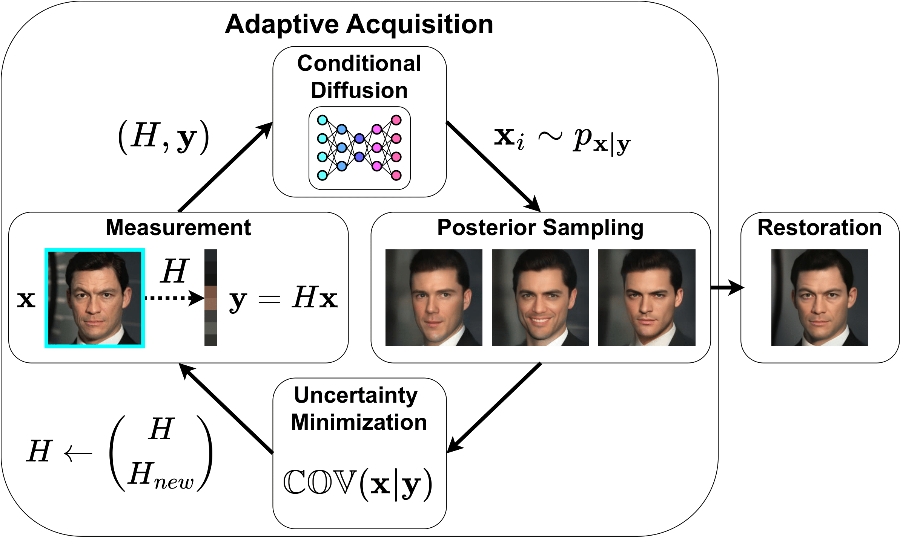

# Adaptive Compressed Sensing with Diffusion-Based Posterior Sampling (AdaSense)

<a href="https://github.com/noamelata">Noam Elata</a><sup></sup>, <a href="https://tomer.net.technion.ac.il/">Tomer Michaeli</a>, and <a href="https://elad.cs.technion.ac.il/">Michael Elad</a>, Technion - Israel Institute of Technology.<br />




This code implements <a href="https://arxiv.org/abs/2407.08256">Adaptive Compressed Sensing with Diffusion-Based Posterior Sampling</a>.

## Running the Experiments
Please refer to `environment.yml` for a list of conda/mamba environments that can be used to run the code. 

For the CT experiment, please install the [`torch-radon`](https://github.com/matteo-ronchetti/torch-radon/tree/v2) package, which can be done with the following command:
```
pip install --force-reinstall --no-cache-dir https://rosh-public.s3-eu-west-1.amazonaws.com/radon-v2/cuda-11.1/torch-1.8/torch_radon-2.0.0-cp38-cp38-linux_x86_64.whl
```

### Pretrained models
We use pretrained model from [SDEdit](https://github.com/ermongroup/SDEdit) for the facial image experiment, and our own pre-trained diffusion models for medical images.

The checkpoint used in the MRI model is available [here](https://drive.google.com/file/d/1Vzu0ixfV2CDnEGlSQjmlCOuw2gS10Ync/view?usp=sharing).

### Sampling from the model

To use adasense to restore images use the following command:
```
python main.py --ni --config {CONFIG}.yml --doc {DATASET} -i {IMAGE_FOLDER} --deg adasense
```
where the following are options
- `CONFIG` is the name of the config file (see `configs/` for a list), including hyperparameters such as batch size and network architectures.
- `DATASET` is the name of the dataset used, to determine where the checkpoint file is found.
- `IMAGE_FOLDER` is the name of the folder the resulting images will be placed in (default: `images`)


As the code is derived from [DDRM](https://github.com/bahjat-kawar/ddrm), the general command to sample from the model for any inverse problem is as follows:
```
python main.py --ni --config {CONFIG}.yml --doc {DATASET} -i {IMAGE_FOLDER} --timesteps {STEPS} --eta {ETA} --deg {DEGRADATION} 
```
where the following are options
- `CONFIG` is the name of the config file (see `configs/` for a list), including hyperparameters such as batch size and network architectures.
- `DATASET` is the name of the dataset used, to determine where the checkpoint file is found.
- `IMAGE_FOLDER` is the name of the folder the resulting images will be placed in (default: `images`)
- `STEPS` controls how many timesteps used in the process.
- `ETA` is the eta hyperparameter in the paper. (default: `0.85`)
- `DEGREDATION` is the type of degredation allowed. (One of: `cs2`, `cs4`, `inp`, `inp_lolcat`, `inp_lorem`, `deno`, `deblur_uni`, `deblur_gauss`, `deblur_aniso`, `sr2`, `sr4`, `sr8`, `sr16`, `sr_bicubic4`, `sr_bicubic8`, `sr_bicubic16` `color`)

## Image Compression

Please refer to the implementation of [PSC: Posterior Sampling-Based Compression](https://arxiv.org/abs/2407.09896) at https://github.com/noamelata/PSC

## References and Acknowledgements
```BibTeX
@article{elata2024adaptive,
    title={Adaptive Compressed Sensing with Diffusion-Based Posterior Sampling}, 
    author={Elata, Noam and Michaeli, Tomer and Elad, Michael},
    year={2024},
    journal={arXiv preprint arXiv:2407.08256},
}
```
This implementation is based on [DDRM](https://github.com/bahjat-kawar/ddrm).

